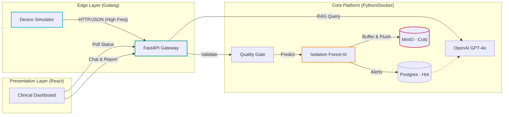
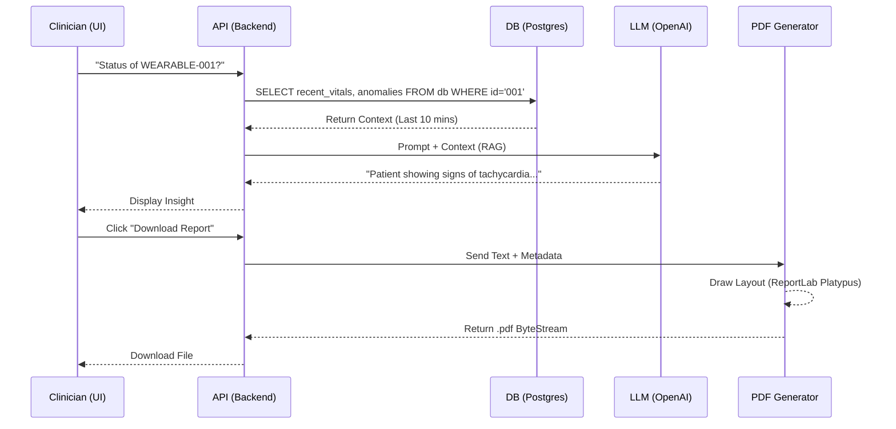

# BioStream Sentinel: Clinical IoT Anomaly Detection Platform

> **A Production-Grade Medical IoT System combining High-Throughput Ingestion, Unsupervised ML, and Generative AI.**

[](https://youtu.be/R03GoaiexJM)

> 📺 **[Watch the Platform Demo](https://youtu.be/R03GoaiexJM)** featuring Golang high-concurrency simulation, Isolation Forest AI, and GenAI Clinical Reporting.


**BioStream Sentinel** is a reference architecture for **Modern Clinical Decision Support**. It bridges the gap between raw device telemetry (IoT) and actionable medical insights (AI). It features a high-concurrency simulator, a tiered hot/cold storage engine, real-time anomaly detection, and a context-aware RAG Assistant for generating clinical reports.

---

## 1. Why This Exists (The Problem & Solution)

In modern healthcare, ICU devices generate massive amounts of data. Clinicians suffer from "Alert Fatigue" and cannot manually correlate thousands of data points to find subtle deterioration. BioStream Sentinel solves this by automating the pipeline from sensor to insight.

| The Problem | BioStream Sentinel Solution |
| --- | --- |
| **Data Velocity** | Millions of sensor readings overwhelm traditional SQL databases. |
| **Static Thresholds** | Hardcoded limits (e.g., HR > 100) miss context and subtle anomalies. |
| **Alert Fatigue** | Clinicians ignore constant beeping. |
| **Compliance** | Data is fleeting and hard to document. |

---

## 2. Architecture Overview

BioStream implements a **Microservices Architecture**, utilizing containerized services for simulation, ingestion, storage, and visualization.

### System Context

The Data Lifecycle: Simulate  Detect  Persist  Visualize.



### The "RAG & Reporting" Logic

How the AI Assistant retrieves context to generate professional PDFs.



---

## 3. Architecture Decision Records (ADR)

Strategic engineering choices for a reliable medical platform.

| Component | Decision | Alternatives Considered | Justification (The "Why") |
| --- | --- | --- | --- |
| **Ingestion Simulator** | **Golang** | Python / Node.js | **Concurrency:** Go's goroutines allow us to simulate thousands of concurrent medical devices with minimal CPU overhead compared to Python threads. |
| **Storage Engine** | **Hybrid (PG + MinIO)** | Postgres Only / MongoDB | **Cost & Scale:** Storing raw high-frequency telemetry in SQL is expensive and slow. Offloading bulk data to Parquet (MinIO) reduces storage costs by ~90% while keeping SQL fast for metadata. |
| **Anomaly Detection** | **Isolation Forest** | Static Rules / Deep Learning | **Unsupervised Learning:** We don't always have labeled "sick" data. Isolation Forest works unsupervised to detect deviations from the norm without needing massive training sets. |
| **Frontend** | **Vite + React** | Streamlit / Jinja2 | **Interactivity:** A clinical dashboard requires real-time state management and zero-latency UI updates which React handles better than server-side rendered templates. |

---

## 4. Key Engineering Features

### A. Tiered Storage Engine (Hot vs. Cold)

The system implements a dual-write strategy to balance speed and retention.

* **Hot Storage (Postgres):** Stores Metadata, Patient IDs, and *Anomalies* only. Optimized for fast queries by the Dashboard.
* **Cold Storage (MinIO Data Lake):** Raw telemetry is buffered in memory (batches of 50) and flushed to **Parquet** files in the Object Store. This creates an immutable data lake for future data science.

### B. GenAI Clinical Assistant (RAG)

We don't just dump data; we interpret it.

* **Context Retrieval:** When a user asks about a specific device (`WEARABLE-007`), the backend intercepts the query, fetches the last 20 vitals from the DB, and injects them into the System Prompt.
* **Safety Rails:** The PDF generator uses XML escaping to prevent AI hallucinations from breaking the document structure.

### C. Production Containerization

* **Docker Compose Orchestration:** Full networking stack where services resolve via internal DNS (`postgres`, `minio`, `backend`).
* **Multi-Stage Builds:** The Frontend and Simulator use multi-stage Docker builds to result in tiny production images (Nginx for React, Alpine for Go).

---

## 5. Tech Stack

| Layer | Technology | Role |
| --- | --- | --- |
| **Ingestion** | **Golang 1.22** | High-performance device simulation. |
| **API** | **FastAPI (Python 3.11)** | Async REST API, Pydantic Validation, Middleware. |
| **Database** | **PostgreSQL 16** | Relational storage for Alerts and Device Metadata. |
| **Data Lake** | **MinIO (S3 Compatible)** | Object storage for raw telemetry (Parquet format). |
| **AI Model** | **Scikit-Learn** | Isolation Forest for numerical anomaly detection. |
| **LLM** | **OpenAI GPT-4o-mini** | Clinical text summarization and interpretation. |
| **Frontend** | **React + TypeScript** | Dashboard UI, Tailwind CSS styling. |
| **Reporting** | **ReportLab** | Programmatic PDF generation engine. |
| **Testing** | **Pytest / Vitest** | Full-stack automated testing suite. |

---

## 6. Getting Started

### Prerequisites

* **Docker Desktop** (Engine 24+)
* **Make** (standard on Linux/Mac, use Git Bash on Windows)
* **OpenAI API Key**

### Step 1: Configuration

Create a `.env` file in the root directory.

```ini
# Core Settings
PROJECT_NAME="BioStream Sentinel"
ENVIRONMENT="production"

# Database & Storage (Internal Docker Network)
POSTGRES_USER=biostream_user
POSTGRES_PASSWORD=biostream_secure_pass
POSTGRES_DB=biostream_db
POSTGRES_HOST=postgres

MINIO_ENDPOINT=minio:9000
MINIO_ROOT_USER=minio_admin
MINIO_ROOT_PASSWORD=minio_secure_pass

# AI Services
OPENAI_API_KEY=sk-proj-your-actual-key-here

```

### Step 2: Build & Launch

We use a unified `Makefile` to handle the full lifecycle.

```bash
# Clean any previous artifacts
make clean

# Build and Start the System (Detached mode)
make up

```

### Step 3: Validate the Pipeline

1. **Dashboard:** Open `http://localhost:3000`. You should see real-time device stats.
2. **Simulation:** Watch the logs to see data flowing:
```bash
make logs

```


3. **AI Chat:** On the dashboard, type *"Status of WEARABLE-[ID Here]"* to test the RAG pipeline.
4. **Data Lake:** Visit `http://localhost:9001` (User: `minio_admin` / Pass: `minio_secure_pass`) to see the raw Parquet files accumulating.

### Step 4: Run Quality Assurance

Execute the full test suite (Backend Logic + Frontend Components).

```bash
make test

```

---

## 7. Project Structure

```text
biostream-sentinel/
├── Makefile                   # Engineer's Control Plane
├── docker-compose.yml         # Production Orchestration
├── .env                       # Environment Configuration
├── src/
│   ├── backend/               # FastAPI Application
│   │   ├── app/
│   │   │   ├── api/           # Endpoints (Ingestion, Analytics, Chat)
│   │   │   ├── services/      # Business Logic (AI, Storage, Report)
│   │   │   └── core/          # Config & Logging
│   │   ├── tests/             # Pytest Suite
│   │   └── Dockerfile         # Python Slim Image
│   ├── frontend/              # React Application
│   │   ├── src/components/    # Dashboard, ChatAssistant
│   │   ├── src/tests/         # Vitest Suite
│   │   └── Dockerfile         # Node Build -> Nginx Serve
│   └── simulator/             # Golang Load Generator
│       ├── main.go            # Routine Scheduler
│       └── Dockerfile         # Multi-stage Go Build
└── infra/                     # Legacy/Dev Infrastructure

```

---

## 8. FinOps & Cost Modeling

**Scenario:** Monitoring 1,000 Devices (1Hz Frequency).

| Resource | Strategy | Est. Cost |
| --- | --- | --- |
| **Compute** | **Containerized:** The entire stack runs on a single mid-sized node (e.g., t3.medium) due to efficient Go/Rust components. | **~$30/mo** |
| **Storage** | **Parquet Compression:** Converting JSON to Parquet reduces volume by ~80%. 10GB of raw JSON becomes ~2GB Parquet. | **~$0.10/mo** (S3) |
| **GenAI** | **GPT-4o-mini:** We use the cost-effective "mini" model. ~500 tokens per clinical report. | **<$5.00/mo** |

---

## Developer Spotlight

**Nahasat Nibir**
*Full Stack Data Engineer & AI Architect*

> "BioStream Sentinel demonstrates that medical-grade software doesn't have to be slow or clunky. By combining the concurrency of Go, the strictness of Pydantic, and the intelligence of LLMs, we create a system that is both robust enough for the ICU and smart enough for the clinician."

---